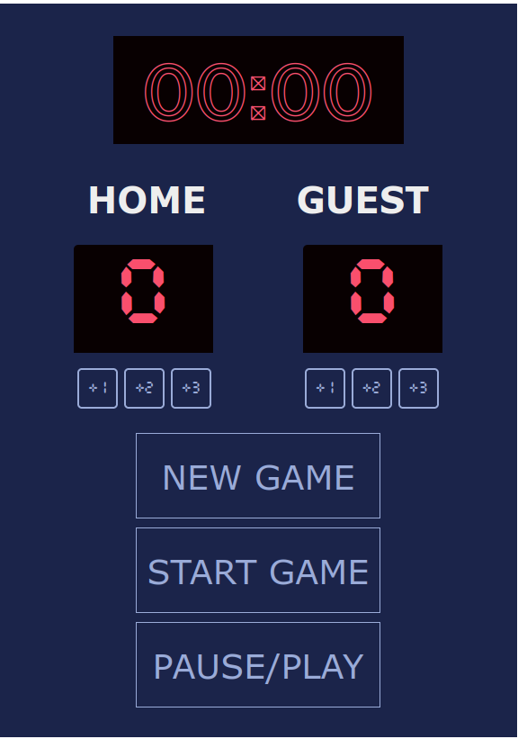

Standard basketball scoreboard, designed using HTML5, CSS, and JavaScript.

Some features include
- New game button
- Start game button
- pause/play button
- points button for 1, 2, and 4 points
- a timer for a standard 4 quarter game.

quarter indicator  not included.
